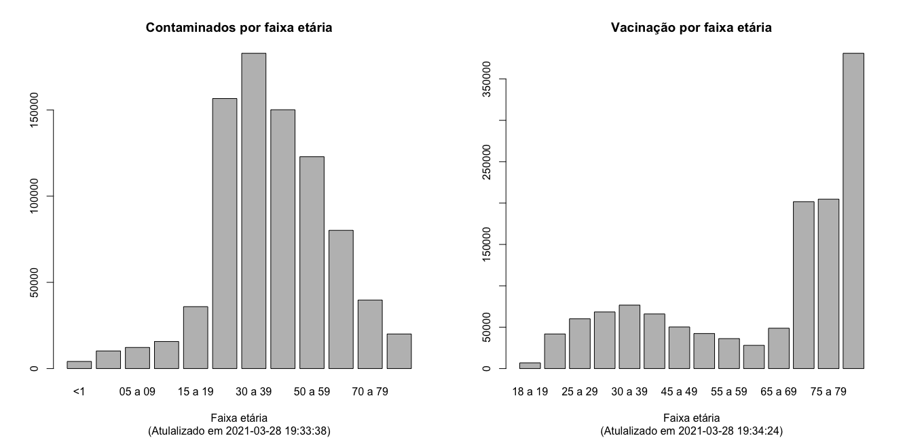

# covid19
Some exercises with public covid19 databases.

```r
# working directory
setwd(tempdir())
getwd()

# covid19
download.file('https://ti.saude.rs.gov.br/covid19/download', 'temp.csv', 
              mode =  'wb')
c19 = read.csv('temp.csv', sep = ';')
unlink('temp.csv')
head(c19)
str(c19)
(tab = table(c19$FAIXAETARIA))
par(mfrow=c(1,2))
barplot(tab, main = 'Contaminados por faixa etária', xlab = 'Faixa etária',
        sub = paste0('(Atualizado em ', Sys.time(), ')') )

# vacina
download.file('https://vacina.saude.rs.gov.br/api/aplicacao', 'temp.csv', 
              mode =  'wb')
vac.apl = read.csv('temp.csv', sep = ';', encoding = 'latin1')
unlink('temp.csv')
head(vac.apl)
str(vac.apl)
(tab2 = table(vac.apl$FAIXAETARIA))
round(prop.table(tab2), 3)
barplot(tab2, main = 'Vacinação por faixa etária', xlab = 'Faixa etária',
        sub = paste0('(Atualizado em ', Sys.time(), ')') )
```

